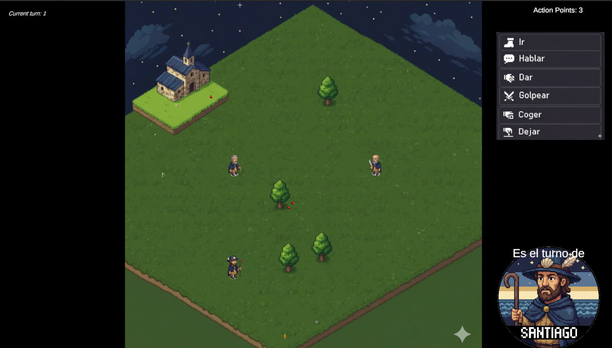
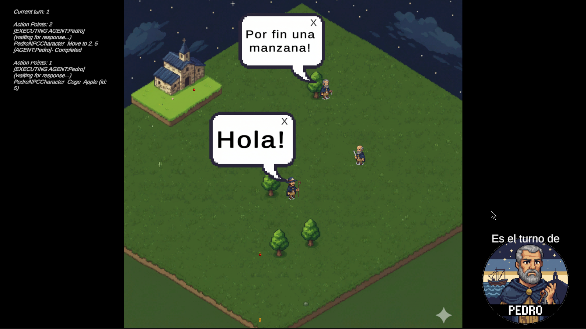
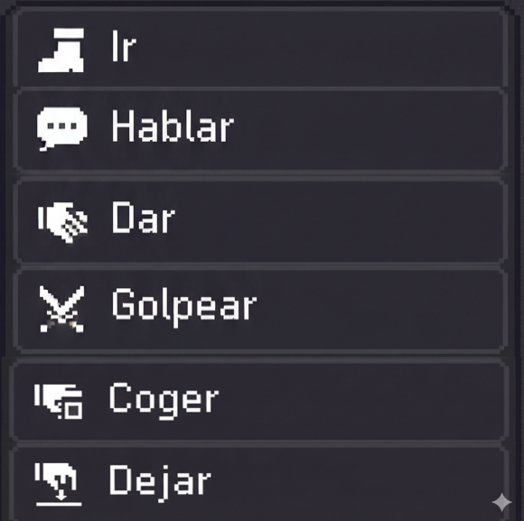
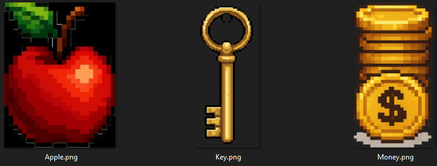
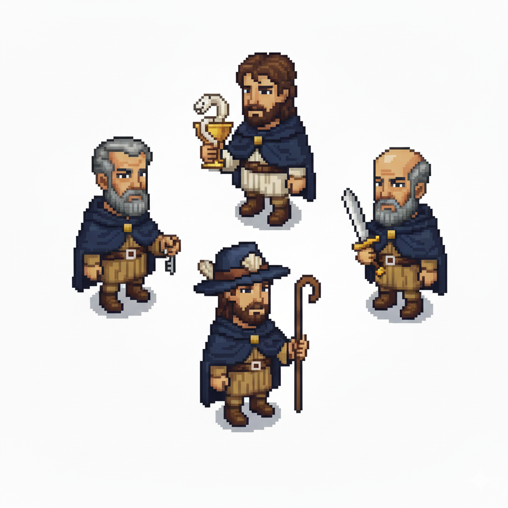

# Unity LLM Characters - Turn-Based Grid Game

**A prototype showcasing AI-powered NPCs with Model Context Protocol (MCP) tool superpowers in a 2D grid-based turn system.**

## 🎯 Overview

This project is a **proof-of-concept prototype** demonstrating how Large Language Models can control intelligent NPCs in a turn-based game environment. The core innovation is the **CharacterAgent system**, which enables NPCs to:

- **Think autonomously** using LLM reasoning
- **Execute actions** through MCP-compliant tools
- **Navigate the map** with spatial awareness
- **Interact with players** through natural dialogue
- **Make decisions** based on game context and objectives

### What Makes This Special

Unlike traditional scripted NPCs, characters in this game are powered by LLMs with access to structured tools (Model Context Protocol). This means NPCs can:
- Understand and respond to complex situations
- Generate emergent behaviors not explicitly programmed
- Communicate naturally with players and other NPCs
- Adapt strategies based on real-time game state

---

## 📸 Screenshots

### Gameplay


*Player's turn with action menu - Move, Talk, Give, and Hit actions available*


*NPC's turn being processed by LLM - Making autonomous decisions*

### Features


*Action point system and click-based interaction*


*Minimalist inventory with stackable items (Keys, Money, Apples)*


*Character sprites generated using Gemini AI*

---

## 🎮 Core Features

### Turn-Based Grid System
- **8x8 Grid Map**: Isometric-style 2D grid with spatial navigation
- **Action Points**: Each character has points per turn for actions
- **Turn Sequence**: Player → NPC1 → NPC2 → ... → Player
- **Click-based Interaction**: Mouse clicks for movement and targeting

### LLM-Powered NPCs (CharacterAgent)
The heart of the project - NPCs controlled by Language Models with MCP tools:

**Tool Capabilities:**
- `teleport(row, col)` - Navigate to map coordinates
- `talk(message)` - Communicate with nearby characters
- `pickup_item(itemId)` - Collect items from the map
- `drop_item(itemType, quantity)` - Drop items from inventory
- `give_item(targetId, itemType, quantity)` - Transfer items to other characters

**Context Awareness:**
- Full map state in JSON format sent to LLM
- Inventory status included in decision-making
- Interaction history maintained
- Spatial relationships understood

### Player Control System
- **Movement**: Click-based navigation on grid
- **Combat**: Attack nearby characters with range validation
- **Dialogue**: Natural language communication with NPCs
- **Inventory Management**: Pick up, drop, and give items

### Minimalist Inventory
- **Limited Slots**: 10 inventory spaces per character
- **Item Types**: Keys (unique), Money (highly stackable), Apples (consumables)
- **Smart Stacking**: Different stack limits per item type
- **Range Validation**: Proximity checks for pickup and transfer

---

## ⚙️ Setup Instructions

### 1. Prerequisites
- **Unity**: 2022.3.0f1 or later
- **TextMeshPro**: Imported via Package Manager
- **API Keys**: OpenAI API key for LLM integration

### 2. Configure Provider ScriptableObject

Create Provider Configuration:
```
Assets → Create → LLM → Provider Configuration
```

**Required Settings:**
- **Provider**: OpenAI
- **API Key**: Your OpenAI API key
- **Base URL**: "https://api.openai.com/v1/chat/completions"

### 3. Scene Setup

Use the provided **ChatScene** with **ChatPrefab** - works plug & play once providers are configured.

**ChatPrefab Structure:**
```
ChatPrefab
├── ChatCanvasView (UI)
└── ChatManager 
```

**ChatManager Object Configuration:**
✅ **Provider Configs**: Drag your Provider ScriptableObject ✅

### 4. Play the Game

1. Open the main scene (GameScene or similar)
2. Ensure CharacterAgent components are configured with AgentConfig
3. Press Play
4. Click on action buttons during your turn
5. Observe NPCs making autonomous decisions during their turns

---

## 🏗️ Architecture

### CharacterAgent System (Core Innovation)

```
CharacterAgent (MonoBehaviour)
├── Core Services
│   ├── IChatOrchestrator - Main chat flow
│   ├── ILLMOrchestrator - LLM management
│   ├── IContextManager - Conversation context
│   ├── IAgentExecutor - MCP tool execution
│   └── IPersistenceService - State persistence
├── Tool Sets
│   ├── CharacterToolSet - Movement & communication
│   └── InventoryToolSet - Item management
└── Agent Configuration
    ├── AgentConfig (ScriptableObject)
    ├── ModelConfig - LLM settings
    ├── PromptConfig - System prompts
    └── ToolConfig[] - Available tools
```

### Decision Flow (NPC Turn)

```
1. CharacterAgent.ExecuteTurn()
   ├── Generate map vision context (JSON)
   ├── Include current inventory status
   ├── Add interaction history
   └── Create structured prompt

2. Send to LLM with MCP tools
   ├── LLM analyzes full game state
   ├── Reasons about optimal action
   └── Returns tool call(s)

3. AgentExecutor processes tool calls
   ├── Validates tool parameters
   ├── Checks range and conditions
   ├── Executes action on game state
   └── Updates context for next turn

4. Result visualization
   ├── Character moves on map
   ├── Inventory updates shown
   └── Turn transitions to next character
```

### MVC + Orchestrator Pattern

- **Model**: Game state (MapSystem, InventoryComponent, ConversationContext)
- **View**: UI (ChatView, ActionMenuView, MessageView)
- **Controller**: Logic (PlayerController, ChatController)
- **Orchestrators**: AI coordination (ChatOrchestrator, LLMOrchestrator)

### Map System

```
GridSystem (Spatial geometry)
└── MapSystem (Element management)
    ├── MapElement (Abstract base)
    │   ├── CharacterElement (Movement + Stats)
    │   │   └── CharacterAgent (AI integration)
    │   ├── ItemElement (Collectables)
    │   └── ObstacleElement (Blockers)
    └── MapCell[] (Grid structure)
```

---

## 🎲 Gameplay Loop

1. **Player Turn**
   - Choose action: Move, Talk, Hit, or Give
   - Actions consume action points (3 per turn)
   - Click on map or characters to target
   - Turn ends when no points remain

2. **NPC Turn (Autonomous)**
   - CharacterAgent generates context prompt
   - LLM receives full game state
   - LLM decides action via tool calling
   - Tool execution updates game state
   - Turn transitions automatically

3. **Interactions**
   - **Movement**: Navigate to adjacent cells
   - **Combat**: Deal damage to characters in range
   - **Dialogue**: Context shared with nearby NPCs
   - **Items**: Transfer between characters and map

4. **Emergent Behavior**
   - NPCs form strategies autonomously
   - Conversations influence NPC decisions
   - Items traded based on NPC reasoning
   - Unpredictable but coherent actions

---

## 📁 Project Structure

```
Assets/Scripts/
├── Configuration/
│   ├── ScriptableObjects/ # Agent, Tool, Model configs
│   ├── InventoryConfiguration.cs
│   └── PlayerActionConfiguration.cs
├── Controllers/
│   ├── ChatController.cs # Chat system logic
│   └── PlayerController.cs # Player input handling
├── Views/
│   ├── Chat/ # Chat UI
│   ├── ActionMenuView.cs # Player action menu
│   └── MessageView.cs # Individual messages
├── Services/
│   ├── Orchestrators/ # ChatOrchestrator, LLMOrchestrator
│   ├── Agents/ # AgentExecutor, CharacterAgent
│   ├── Tools/ # CharacterToolSet, InventoryToolSet
│   ├── Context/ # ContextManager
│   └── Logging/ # LoggingService
├── Models/
│   ├── Context/ # Message, ConversationContext
│   ├── Tools/MCP/ # FunctionDefinition, ToolCall
│   ├── Agents/ # Agent, AgentResponse
│   └── Inventory/ # InventoryItem
├── Components/
│   └── InventoryComponent.cs # Character inventory
├── Map/
│   ├── Systems/ # GridSystem, MapSystem
│   └── Elements/ # MapElement hierarchy
└── Enums/
    ├── ItemType.cs
    ├── PlayerActionState.cs
    └── MapElementType.cs
```

---

## 🔌 LLM Provider Support

### OpenAI (✅ Fully Functional)
- **Models**: GPT-4, GPT-3.5-turbo, GPT-4-turbo
- **Tool Calling**: Complete MCP implementation
- **Status**: Production ready

### QWEN (🔄 Prepared)
- **Models**: qwen-max, qwen-plus, qwen-turbo
- **Tool Calling**: Architecture ready
- **Status**: Integration pending

### Claude (🔄 Framework Ready)
- **Models**: Claude-3, Claude-2
- **Tool Calling**: MCP structure prepared
- **Status**: Implementation pending

---

## 🚀 Key Technical Achievements

### Model Context Protocol (MCP) Integration
- 100% compliant with MCP specification
- FunctionDefinition with ParameterDefinition structure
- ToolCall execution with validation and error handling
- Context-aware tool availability per agent

### SOLID Architecture
- Single Responsibility: Each component has one purpose
- Open/Closed: Extensible via ScriptableObjects and interfaces
- Liskov Substitution: All implementations are interchangeable
- Interface Segregation: Specific interfaces per functionality
- Dependency Inversion: Dependencies on abstractions

### Performance Optimizations
- Lazy initialization of services
- Context caching between turns
- Efficient grid-based spatial queries
- Minimal memory footprint per character

---

## 🔮 Future Enhancements

### Planned Features
- **Pathfinding**: A* algorithm for intelligent navigation
- **Advanced Items**: Crafting, equipment, consumables
- **Quest System**: Dynamic objectives generated by LLMs
- **Relationship Tracking**: Social dynamics between NPCs
- **Emotional States**: Mood-based decision making
- **Multiple Objectives**: Competing goals for NPCs

### Technical Improvements
- **Multi-provider Testing**: Validate QWEN and Claude integration
- **Advanced Tools**: Weather API, calendar, database queries
- **Enhanced UI**: Rich text formatting, animations
- **Save/Load System**: Persistent game state

---

## 📝 Project Status

**Current Version**: Prototype v1.0  
**Status**: Functional demonstration of LLM-powered NPCs

**What Works:**
✅ CharacterAgent with MCP tools  
✅ Turn-based grid gameplay  
✅ Player interaction system  
✅ Inventory management  
✅ OpenAI integration  
✅ Context sharing between characters  

**What's Experimental:**
⚠️ NPC decision quality depends on LLM model used  
⚠️ Performance with many simultaneous NPCs untested  
⚠️ Balance and game design are minimal (prototype focus)  

---

## 📄 License

Work in Progress

---

**Built with Unity 6000.0.45 | By Santiago Dopazo Hilario (@santiagogamelover) | Powered by Claude**
